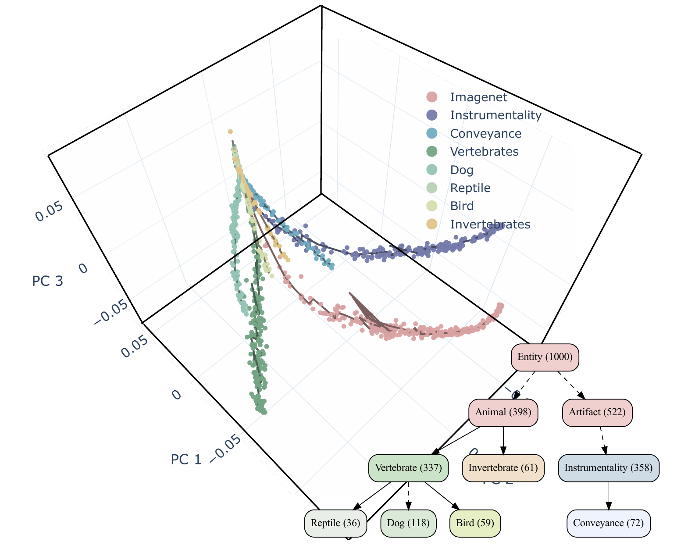

# Picture of the Space of Learnable Tasks

This repository includes code to reproduce the results of the paper titled (*A picture of the space of typical learnable tasks*) by [Rahul Ramesh](https://rahulramesh.info), [Jialin Mao](https://www.linkedin.com/in/jialin-mao-339346182), [Itay Griniasty](https://scholar.google.co.il/citations?user=a3Uhp58AAAAJ&hl=en), [Rubing Yang](https://www.amcs.upenn.edu/people/rubing-yang), [Han Kheng Teoh](https://www.linkedin.com/in/han-kheng-teoh-09392a70), [Mark K. Transtrum](https://physics.byu.edu/faculty/transtrum/index), [James P. Sethna](https://sethna.lassp.cornell.edu) and [Pratik Chaudhari](https://pratikac.github.io/) that was presented at ICML 2023. [arXiv](https://arxiv.org/abs/2210.17011)

We developed information-geometric techniques to understand the representations learned by algorithms like supervised, transfer, meta, semi, self-supervised learning as they learn different kinds of tasks. We found that the manifold of probabilistic models trained on different tasks using different representation learning methods is effectively low-dimensional, and this dimensionality is extremely small. For example, trajectories of the predictions of deep networks trained on different subsets of Imagenet can be embedded in *three* dimensional space. This seems to indicate that typical tasks have a very strong shared structure. The structure of the space of visual classification tasks as evidenced by our techniques is consistent with the ontology of Wordnet (which was created using natural language semantics). This paper also studies the behavior of the different representation learning algorithms and finds that (a) episodic meta-learning algorithms and supervised learning traverse different trajectories during training but they fit similar models eventually, (b) contrastive and semi-supervised learning methods traverse trajectories similar to those of supervised learning, etc.

The above paper builds upon some sophisticated mathematical techniques that we developed in (*The Training Process of Many Deep Networks Explores the Same Low-Dimensional Manifold*) by [Jialin Mao](https://www.linkedin.com/in/jialin-mao-339346182), [Itay Griniasty](https://scholar.google.co.il/citations?user=a3Uhp58AAAAJ&hl=en), [Han Kheng Teoh](https://www.linkedin.com/in/han-kheng-teoh-09392a70), [Rahul Ramesh](https://rahulramesh.info), [Rubing Yang](https://www.amcs.upenn.edu/people/rubing-yang), [Mark K. Transtrum](https://physics.byu.edu/faculty/transtrum/index), [James P. Sethna](https://sethna.lassp.cornell.edu) and [Pratik Chaudhari](https://pratikac.github.io/); [arXiv](https://arxiv.org/abs/2305.01604). This paper examines the representation of a deep network as a high-dimensional probabilistic model to reveal that the training process explores an effectively low-dimensional manifold. Networks with a wide range of architectures, sizes, trained using different optimization methods, regularization techniques, data augmentation techniques, and weight initializations lie on the same manifold. This manifold is also extremely low-dimensional, e.g., the top 3 dimensions can faithfully capture the geometry in the space of predictions of more than 150,000 networks with differnt configurations.

**Starter Colab notebook to understand information geometry in a very simple way**: A good place to start would be [this jupyter notebook](https://colab.research.google.com/github/grasp-lyrl/picture_of_space_of_tasks/blob/main/picture_of_tasks_tutorial.ipynb). It contains a brief overview of the techniques and only takes a few minutes to run on Google Colab.

As an example of the kinds of results one can obtain using these techniqus, consider the figure below. We have plotted the representations learned by networks trained on different subsets of ImageNet. Interestingly, the trajectories of the representations resemble the Wordnet phylogenetic tree, which was built using only natural language-based semantics. 

<p align="center">

</p>

We can use these techniques to compare representations learnt using
different *datasets* and using different *methods*---making them usable across
many different settings. We study phenomena relating to supervised, meta- and
contrastive learning and fine-tuning by studying networks in prediction space. 


## Setup

[micromamba](https://mamba.readthedocs.io/en/latest/installation.html) is a nicer package manager than anaconda and it is highly recommended. To install the packages run:

```
micromamba create -y -f env.yml
micromamba activate picture
```

## Usage

The steps below can be used to reproduce the supervised learning results on ImageNet. Feel free to send us an email if you want code to reproduce the other results.

**Step 1**: Generate network trajectories. We first train networks and store predictions at different points on the training trajectory. The folder [supervised_imagenet](./supervised_imagenet), describes how to train a network on ImageNet. 

You can skip this step and download the ImageNet trajectories from [this link](https://mega.nz/folder/lAU2EBTT#6NXdRnL2RUoZL06e2baP7A); Move the downloaded files to the `predictions/` folder.

**Step 2**: Analyze the trajectories. The folder [info_geometry](./info_geometry) contains code to generate InPCA embeddings and compare different trajectories.

```bash
cd info_geometry
python inpca.py
python trajectory.py
```


## Directory Structure

```
.
├── picture_of_tasks_tutorial.ipynb
├── README.md
├── LICENSE
├── env.yml
├── info_geometry          
│   ├── inpca.py           # Compute InPCA embedding on data
│   └── trajectory.py      # Analyze training trajectories
├── supervised_imagenet    
│   ├── 01_training        # Train models and store trajectory weights
│   └── 02_imprinting      # Imprint models and store predictions
├── predictions            # Folder to store trajectories
└── plots
```

